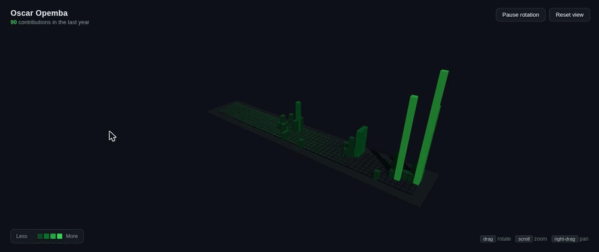
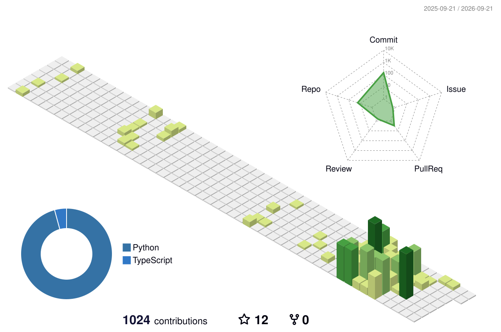

<h1 align="center">Oscar Opemba</h1>

  <b>Red Teamer · Security Researcher · Full-Stack Engineer</b> 
  I break systems to understand them, then build the tooling that makes the next break faster.

  
  
  

---

### About

Offensive-security practitioner working across the full attack lifecycle — recon, exploitation, post-exploitation, and C2 — plus the engineering side that supports it. My public work spans red-team tradecraft (C2 evasion, EDR bypass), web-app and bug-bounty methodology, and production-grade full-stack and ML systems. I build tools I actually use and document the methodology so it's repeatable. Currently deepening red-team automation and adversary emulation.

---

### Contribution Activity

  
   
  <a href="https://oscar-opemba.github.io/Oscar-Opemba/"><b>▶ Explore the interactive 3D skyline</b></a> — rotate, zoom, and orbit the real thing.

  
Daily-refreshed still (renders after the workflow's first run)

  

    <picture>
      <source media="(prefers-color-scheme: dark)" srcset="./profile-3d-contrib/profile-night-view.svg">
      <source media="(prefers-color-scheme: light)" srcset="./profile-3d-contrib/profile-green.svg">
      
    </picture>
  

> _The preview above is a recording of the live WebGL / Three.js scene ([source](./docs/index.html)), which pulls contribution data in real time. GitHub READMEs can't run JavaScript, so true interactive 3D lives on GitHub Pages and is one click away. The collapsible still is regenerated daily by a GitHub Action ([`github-profile-3d-contrib`](https://github.com/yoshi389111/github-profile-3d-contrib)). See the setup checklist below._

---

### Featured Work

**Offensive Security**

- **[C2-Evasion-Toolkit](https://github.com/Oscar-Opemba/C2-Evasion-Toolkit)** — Red-team C2 stealth: polymorphic payload generation (Go), in-memory C# execution with API hashing for EDR bypass, and domain fronting for network-level cover.
- **[bugbounty-arsenal](https://github.com/Oscar-Opemba/bugbounty-arsenal)** — Web-app pentesting & bug-bounty kit: methodology, checklists, custom recon / broken-access-control / API tooling, and hands-on vulnerable labs.
- **[cybersecurity-resources](https://github.com/Oscar-Opemba/cybersecurity-resources)** — Curated references, scripts, tools, labs, and training material — the reference library behind the rest of the work.

**Engineering**

- **[vivasec](https://github.com/Oscar-Opemba/vivasec)** — VivaSec: a unified privacy super-app (TypeScript).
- **[trackml-mlops-pipeline](https://github.com/Oscar-Opemba/trackml-mlops-pipeline)** — End-to-end MLOps: MLflow tracking + model registry, Optuna sweeps, an automated promotion gate that refuses regressions, and FastAPI serving that resolves the live production model from the registry.

---

### Skills

**Offensive Security & Tooling**

  
  
  
  
  

**Languages**

  
  
  
  
  
  

**Frameworks & Data**

  
  
  
  
  

**Cloud & Infra**

  
  
  
  
  

---

### Stats

  
  

---

### Connect

  
  
  <!-- Add once you have them: LinkedIn, X/Twitter, email, personal site, TryHackMe, HackTheBox -->

